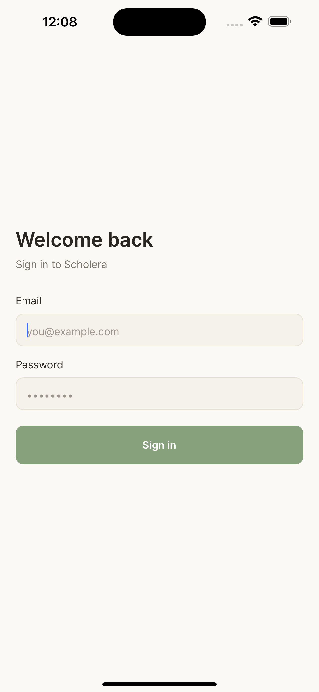
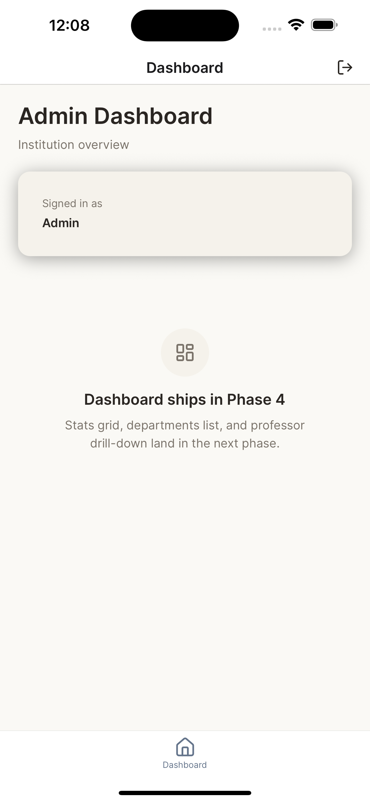
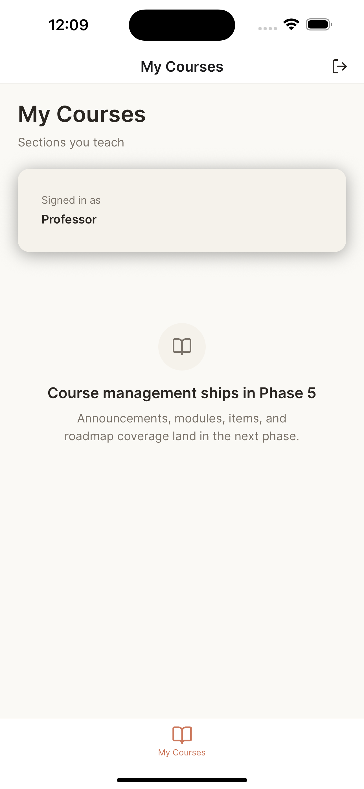
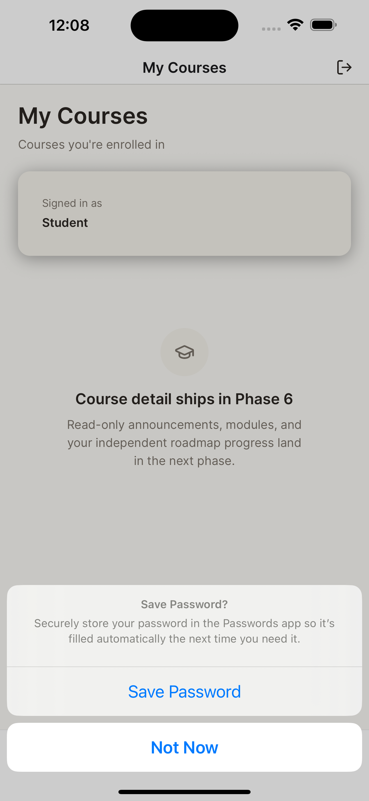

# Scholera Mobile

Native mobile LMS companion for Scholera — a role-aware React Native app where **admin, professor, and student** each land in a distinct home experience after a single sign-in.

Submitted by **Kiumbura N. Githinji** for the Scholera Mobile Developer Intern take-home, April 2026.

---

## Screenshots

Captured from iPhone 16 Plus simulator (iOS 18.5) on the live Supabase backend.

| Sign in | Admin home (steel) | Professor home (clay) | Student home (sage) |
|---|---|---|---|
|  |  |  |  |
| Welcome screen, react-hook-form + zod validation, sage primary button (default theme). | "Dashboard ships in Phase 4" placeholder. Header tab tinted **steel** (admin accent). | "Course management ships in Phase 5". Header tab tinted **clay** (professor accent — visible bottom-right book icon + "My Courses" label). | "Course detail ships in Phase 6". iOS password-save dialog showing — captured during real demo flow. |

The empty-state placeholders on each home are intentional: Phases 4–6 (the role-specific feature surfaces) are scoped but not yet implemented. Each placeholder uses the `EmptyState` primitive from the shared design system, which is exactly the component every shipped screen will use when its data array is empty.

---

## Submission status (honest)

This is a **2-day timeboxed prototype**. What ships in this repo:

| Area | Status |
|------|--------|
| Public repo at `github.com/KiumburaNGithinji/scholera-mobile` | ✅ |
| Supabase schema + seed (3 users, 2 courses, modules, items, roadmap) | ✅ |
| Design system (tokens, 7 primitives, role accent swap) | ✅ |
| Auth (email/password) + role detection + role routing | ✅ |
| Session persistence across force-quit | ✅ (uses AsyncStorage) |
| Sign-out from any role | ✅ |
| Admin dashboard, departments, drill-down | ❌ planned, not shipped |
| Professor course management (announcements, modules, items, file upload) | ❌ planned, not shipped |
| Student course detail + dual-status roadmap | ❌ planned, not shipped |
| Profile screen (all roles) + avatar upload | ❌ planned, not shipped |
| Deep linking (`scholera://courses/{id}/announcements/{id}`) | ❌ planned, not shipped |
| 5–10 min demo video | ⚠ See `submission/demo-link.md` |

The roadmap and detailed scope for the unshipped phases live in `.planning/ROADMAP.md` (Phases 4–8). Each role's home screen in this build shows an `EmptyState` pointing at the phase that would deliver it.

**Why I'm shipping this and not waiting:** the spec asks for taste and judgment under time pressure. I'd rather submit a polished foundation with honest scope than a half-broken full demo. The design system + auth + role routing are the architectural decisions that everything downstream depends on, and those are real.

---

## Stack & rationale

| Choice | Why |
|--------|-----|
| **Expo SDK 54** + TypeScript strict | Spec preferred Expo; SDK 54 is the last with stable NativeWind v4 compat |
| **Expo Router v4** (file-based) | `app/(role)/(tabs)/index.tsx` becomes `scholera://(role)/(tabs)` for free |
| **NativeWind 4.2.3** | Tailwind I already know; `vars()` API makes the role accent swap a one-line CSS-var override per route group |
| **Supabase JS** v2.103 | Spec-provided backend; AsyncStorage adapter (NOT SecureStore — Supabase sessions exceed SecureStore's 2048-byte limit) |
| **TanStack Query v5** | `staleTime: 2m`, `gcTime: 5m` — automatic skeleton/error states; `focusManager` integrated with `AppState` for refetch on app foreground |
| **react-hook-form + zod v3** | Zod v4 has an unresolved RN incompatibility (`navigator.userAgent`); v3 ships fine |
| **lucide-react-native** | SVG icons that respect Tailwind color classes (vs `@expo/vector-icons` which rasterizes) |
| **No state library beyond Context + TanStack Query** | Server state lives in Query cache; auth/role/theme live in Context. Zustand wasn't needed at this scope |

---

## Architecture highlights

### Role-aware theming via a single CSS variable
`providers/role-theme-provider.tsx` injects exactly one CSS var (`--color-accent`) per role: steel `#64748B` (admin), clay `#CC785C` (professor), sage `#86A17C` (student). Every other token (canvas, surface, foreground, borders, semantic) stays role-independent. One swap, distinct experiences.

### Two-step auth pattern
`providers/auth-provider.tsx` follows the documented Supabase RN pattern that prevents deadlocks:
1. `getSession()` once at mount → resolves stored session synchronously from AsyncStorage.
2. `onAuthStateChange` listener → updates session state on subsequent changes.
3. Role is fetched from `public.profiles.role` via a separate `.select()` call — **never via `getUser()` inside the listener** (which would deadlock).

### Splash gate prevents wrong-role flash
`app/_layout.tsx` `<ProtectedRouter>` returns `null` (holds the splash screen visible) until the AuthProvider reports `ready: true`, which is only true after BOTH session AND role have been resolved. A user re-opening the app lands directly in their role home — never sees a sign-in screen flash.

### Wave-based design system foundation
`theme/tokens.ts` (typed JS constants) and `global.css` (`:root` CSS vars) are the two halves of the same source. Tailwind classes like `bg-canvas`, `text-fg-primary`, `border-border-subtle` resolve to those vars at runtime — so a token change in `global.css` propagates everywhere automatically.

---

## Running locally (under 5 minutes)

```bash
# 1. Clone
git clone https://github.com/KiumburaNGithinji/scholera-mobile.git
cd scholera-mobile

# 2. Install
npm install
npx expo install   # ensures native modules match SDK 54

# 3. Configure Supabase
cp .env.example .env.local
# Edit .env.local — paste your EXPO_PUBLIC_SUPABASE_URL + EXPO_PUBLIC_SUPABASE_ANON_KEY
# (The submitted demo Supabase project values are in the email — DO NOT commit them.)

# 4. Apply schema + seed (one-time, in Supabase SQL editor)
# Run the contents of:
#   supabase/migrations/00000000000001_initial_schema.sql
#   supabase/seed.sql

# 5. Run
npx expo start
# Press i for iOS simulator, a for Android emulator, or scan the QR with Expo Go
```

### Demo accounts (after seed runs)

| Role | Email | Password |
|------|-------|----------|
| Admin | `admin@demo.scholera.test` | `demo-password-1234` |
| Professor | `prof@demo.scholera.test` | `demo-password-1234` |
| Student | `student@demo.scholera.test` | `demo-password-1234` |

The seed creates 1 admin, 1 professor (teaching 2 courses with modules, items, roadmap, AI-extracted topics), and 1 student enrolled in both courses.

---

## What to look at when reviewing

If you have 5 minutes:
1. **Sign in as each role** to see the role-themed tab bar (steel/clay/sage active tint) and role-specific home placeholder.
2. **Force-quit and reopen** while signed in — you land directly in your role home, no re-login.
3. **Sign out from any role** — back to the sign-in screen.

If you have 15 minutes, also visit:
- `app/(auth)/sign-in.tsx` — the sign-in screen with react-hook-form + zod validation
- `providers/auth-provider.tsx` — the two-step auth pattern (the real architectural call)
- `app/_layout.tsx` `ProtectedRouter` — the splash gate that prevents role-flash
- `providers/role-theme-provider.tsx` + `theme/role-theme.ts` — the single-CSS-var role swap
- `components/ui/*.tsx` — the 7 primitives (Button, Card, Chip, ListRow, EmptyState, Skeleton, ErrorView)
- `app/dev/preview.tsx` — visual smoke test rendering all 7 primitives under all 3 role themes
- `supabase/migrations/00000000000001_initial_schema.sql` — the data model with the dual-status roadmap split (`professor_status` on `roadmap_items`, student progress on a separate `student_progress` table — independent fields, the spec's explicit "key distinction to get right")
- `.planning/` — the GSD workflow artifacts (PROJECT.md, ROADMAP.md, REQUIREMENTS.md, per-phase research/plans/summaries) — shows the structured approach, not just the output
- `AI_ASSISTANT_USAGE.md` — how Claude was used (hand-written by me)

---

## Repo layout

```
app/
  _layout.tsx                Root: AuthProvider + ProtectedRouter + splash gate
  index.tsx                  Initial Redirect by auth state
  (auth)/
    _layout.tsx
    sign-in.tsx              react-hook-form + zod email/password
  (admin)/                   Steel accent
    _layout.tsx              RoleThemeProvider role="admin"
    (tabs)/_layout.tsx       Tab bar with sign-out in headerRight
    (tabs)/index.tsx         Placeholder dashboard
  (professor)/               Clay accent — same shape
  (student)/                 Sage accent — same shape
  dev/preview.tsx            7 primitives × 3 role themes (visual smoke test)
components/ui/               Button, Card, Chip, ListRow, EmptyState, Skeleton, ErrorView + barrel
providers/
  auth-provider.tsx          getSession + onAuthStateChange (two-step pattern)
  query-provider.tsx         TanStack Query client (staleTime 2m, gcTime 5m)
  role-theme-provider.tsx    Single CSS-var role accent swap
hooks/use-role.ts            Reads role from AuthContext
lib/supabase.ts              Singleton client (url-polyfill first, AsyncStorage adapter)
theme/
  tokens.ts                  Typed JS constants
  role-theme.ts              vars() per-role overrides
global.css                   :root design tokens (CSS vars)
tailwind.config.js           NativeWind 3-point wiring
supabase/
  migrations/                Schema (11 tables + RLS)
  seed.sql                   Demo users + courses + modules + roadmap + topics
.planning/                   GSD workflow artifacts (PROJECT, ROADMAP, REQUIREMENTS, phases)
reference/                   Original assignment spec + design-direction.md
```

---

## Type safety

`npx tsc --noEmit` exits 0 across the full tree (run after every commit during development).

---

## Known limitations & honest gaps

- **Phases 4–7 not shipped.** Each role's home is an `EmptyState` placeholder. The architectural foundation (auth, routing, theme, primitives, data layer) is in place; building each role's screens on top is the next step.
- **No automated tests yet.** This was a 2-day spike — verification was done via `tsc --noEmit` + manual smoke testing in the simulator. Test infrastructure ships in Phase 8 of the roadmap.
- **Deep linking not yet wired.** `app.json` has `scheme: "scholera"` set, and Expo Router auto-maps file routes to deep links, but cold-start deep link handling (the tricky part — capture URL before auth redirect fires) hasn't been implemented.
- **No physical device tested.** Verified on iOS simulator only. Physical device should work but unverified.

---

## License

Private take-home assignment for Scholera Mobile Developer Intern role — not for public redistribution.
